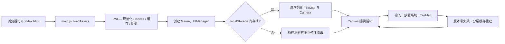

# Mykonos Island Voxels 项目研究报告

> 调研日期：2026-07-22  
> 调研范围：项目源码、静态资源、构建与部署配置；未对线上站点进行网络访问，也未执行浏览器端端到端测试。

## 1. 项目概览

**Mykonos Island Voxels** 是一个面向浏览器的等距视角（isometric）岛屿/小镇自由建造器。用户在固定网格上选择地形、植被、摆件、水景与建筑资源，通过点击、拖拽或触摸手势搭建地中海风格场景。它刻意不引入任务、数值、资源生产或胜负条件，产品定位更接近“可交互的创意玩具”而非传统模拟经营游戏。

项目的视觉主题为希腊米科诺斯岛：白墙、钴蓝色门窗与圆顶、风车、橄榄树、三角梅、浅海与砂石。运行时采用原生 `HTML + CSS + ES Module JavaScript + Canvas 2D`，没有框架、打包器和运行时第三方依赖。

### 核心事实

| 维度 | 结论 |
| --- | --- |
| 运行形态 | 纯静态单页 Web 应用，`index.html` 直接加载 `src/main.js` |
| 网格 | 默认 `14 × 14`，即 196 个地格 |
| 等距尺寸 | 地格 `64 × 32 px`（经典 2:1 菱形）；一格定义为 `4 × 4` voxel |
| 镜头 | 缩放范围 `0.5–3.0`，默认 `1.4`，支持以指针位置为锚点缩放 |
| 资源清单 | 当前 `54` 个（7 地形、6 自然、26 摆件、5 水景、10 建筑） |
| 本地存档 | `localStorage`，键为 `mykonos-island-voxels.save.v1` |
| 音效 | 7 个运行时加载的 OGG 音效；按水、石、木、小型植被、树木等分类路由 |
| 部署 | Netlify；构建脚本生成 `dist/` |

## 2. 启动与用户体验流程

页面首先显示加载卡片。`main.js` 按资源清单顺序加载所有位图，并在每隔两个资源的处理间隙让出一帧，使进度条能够持续刷新。资源就绪后，应用并行预加载 UI 音效，创建游戏控制器和 DOM UI。

接着系统尝试从本地存档恢复场景：

- 有存档：恢复地形、对象与镜头位置，并提示 “Welcome back”。
- 无存档：自动生成示例村庄。196 格草地、道路、水渠、沙滩、房屋和点缀物以 `gx + gy` 为序、每格 32ms 的节奏呈现，形成从后向前推进的建造波纹。



## 3. 功能清单与交互设计

### 编辑能力

- 放置：选择资产后在合法网格中放置；地形会替换该格地表，对象则必须满足完整占地范围为空。
- 擦除：优先删除对象，再删除地形；右键始终代表擦除，触屏端用约 420ms 长按模拟右键。
- 刷绘：鼠标按住左/右键或单指拖动时，进入新格即执行一次放置/擦除；通过格坐标去重，避免同格重复触发。
- 填草：工具栏 `Fill` 只给没有地形的格子铺草，不覆盖用户已经绘制的道路、沙地或水面。
- 预览与校验：悬停时显示半透明资源预览及其占地菱形；蓝色代表可放置，红色代表越界或碰撞，擦除使用粉色提示。
- 翻转：键盘 `H`/`V` 分别切换水平/垂直翻转。翻转状态只在当前选项中生效，切换分类或资源时重置；提交后写入对象数据。
- 视图：滚轮缩放，Shift+拖拽、中键拖拽或平移工具拖拽移动镜头；双指手势同时支持缩放和移动。
- 持久化：`Save` 将地图与镜头序列化；`Reset` 清空地图和本地存档，并重新居中镜头。

### 输入映射

| 桌面端 | 触屏端 | 行为 |
| --- | --- | --- |
| 左键点击/拖动 | 单击/单指拖动 | 放置，或在擦除工具下擦除 |
| 右键点击/拖动 | 长按约 420ms | 擦除 |
| Shift+拖动 / 中键 / 平移工具 | 平移工具下单指拖动 | 平移镜头 |
| 滚轮 | 双指捏合 | 围绕指针/两指中点缩放 |
| `H` / `V` | 无独立手势 | 翻转预览 |
| `E`、`G`、`S`、`R`、`1–5` | UI 按钮/标签 | 工具、网格、保存、重置、分类 |

CSS 使用 `touch-action: none`、`overscroll-behavior: none` 阻止浏览器滚动和默认缩放与画布手势冲突；在 `900px`、`640px`、`380px` 和低高度横屏等断点重新布置资源面板。手机端采用底部资源抽屉、44px 以上的触控目标及 `safe-area-inset-*`，照顾刘海与 Home Indicator；粗指针设备仅显示触屏操作说明。

## 4. 代码结构与职责

```text
.
├── index.html                 页面骨架、Canvas 与 DOM UI 挂载点
├── styles.css                 主题、加载页、响应式布局与移动端适配
├── src/
│   ├── main.js                启动、进度、恢复存档、首场景播种
│   ├── config.js              网格/像素/镜头/调色板等全局常量
│   ├── core/
│   │   ├── Game.js            应用协调器、意图 API、动画循环
│   │   ├── Renderer.js        分层 Canvas 渲染、阴影、预览、动画
│   │   ├── Camera.js          平移、锚点缩放、坐标变换
│   │   └── InputManager.js    鼠标、键盘、触摸、手势解析
│   ├── grid/
│   │   ├── IsoGrid.js         网格与等距世界坐标互转
│   │   └── TileMap.js         双层地图、占用索引、序列化与版本号
│   ├── building/
│   │   ├── PlacementSystem.js 放置合法性和删除规则
│   │   └── PlacedObject.js    已放置对象值模型、占地与深度键
│   ├── assets/                清单、位图转换、加载器、程序化后备资源
│   ├── ui/                    工具栏、资源盘、HUD、提示与音效
│   └── storage/SaveSystem.js  localStorage 持久化
├── assets/                    运行时 PNG、原始图与新增资源
├── tools/process_assets.py    PNG 透明边裁剪工具
├── netlify-build.mjs          静态发布目录复制脚本
└── netlify.toml               Netlify 发布与缓存头配置
```

`Game` 是应用层的协调中心：它持有 `TileMap`、`Camera`、`Renderer`、`PlacementSystem` 与 `InputManager`，向 UI 暴露 `setTool`、`selectAsset`、`save`、`reset` 等意图式 API。UI 不直接改地图；输入也不直接改渲染器，而是经 `Game → PlacementSystem → TileMap` 流转。这种边界使存档、鼠标与触摸路径共享同一套业务规则。

## 5. 世界数据模型与算法

### 双层地图

`TileMap` 是场景唯一事实来源，包含：

- `terrain`：一维数组保存每个格子的地形资源 ID，每格最多一个；
- `objects`：`PlacedObject[]`，保存建筑和摆件；
- `_occupancy`：与网格同尺寸的对象引用索引；
- `terrainVersion` / `objectsVersion`：每次有效变更递增，用于驱动渲染缓存失效。

对象的起点为 `(gx, gy)`，并存储 `footprint: { w, d }`、`flipH`、`flipV`。大型对象如 Villa 占 `4 × 4` 格，Bridge 占 `2 × 1` 格。放置判断会逐格检查边界与 `_occupancy`，其复杂度为 **O(w×d)**；查询 `objectAt` 为 **O(1)**，避免每次悬停扫描对象数组。

对象绘制通过 `sortKey = (gx + w - 1) + (gy + d - 1)` 升序排序，保证更靠后的内容先画、前景对象后画。这是等距 2D 场景常用的画家算法，简单且适合当前没有高度层级互相穿插的资源形式。

### 等距换算

地格宽高分别为 `TW=64`、`TH=32`。格坐标到世界坐标的锚点公式为：

```text
x = (gx - gy) × TW / 2
y = (gx + gy) × TH / 2
```

逆变换先由镜头将屏幕坐标转换回世界坐标，再计算：

```text
gx = (x/(TW/2) + y/(TH/2)) / 2
gy = (y/(TH/2) - x/(TW/2)) / 2
```

最终向下取整得到格子。镜头缩放使用“缩放前后光标下世界点不变”的方式修正偏移，因此滚轮缩放不会把用户正在指向的格子推开。

## 6. 渲染架构与性能策略

渲染器是项目的技术重点。它没有逐帧重画全部场景，而是将内容拆为静态缓存和少量动态叠加层：

| 层 | 坐标空间 | 重建条件 | 内容 |
| --- | --- | --- | --- |
| Chrome | 屏幕空间 | 窗口尺寸变化 | 天空、纸张质感、平台投影、暗角 |
| Platform | 世界空间 | 网格尺寸变化 | 承载岛屿的底座 |
| Terrain | 世界空间 | `terrainVersion` 变化 | 所有非动画地形 |
| Objects | 世界空间 | `objectsVersion` 或动画对象集合变化 | 静态对象的阴影和排序后精灵 |
| Live overlay | 世界空间 | 每次需绘制时 | 放置弹性动画、悬停、高亮与幽灵预览 |

静态层都在离屏 Canvas 中合成。镜头移动和缩放只是对这些世界空间缓存施加变换，不会导致地形或对象重新栅格化。`draw()` 还使用 `_dirty` 标志：若没有相机/地图/UI 状态变化，也没有待播放的动画，直接跳过绘制；但 `requestAnimationFrame` 仍持续注册，以便输入发生时立即恢复。

### 清晰度与内存的取舍

- 主 Canvas 按 `devicePixelRatio` 分配像素，并以 CSS 像素作为绘制坐标。
- 资源加载时会按 `ceil(maxZoom × DPR)`（最小 2 倍）生成 `displayCanvas`；这是将高分辨率 PNG 预缩放为适合运行时 `drawImage` 的中间层。
- 地形与对象缓存采用 `CACHE_SCALE = clamp(ceil(DPR × 1.5), 2, 3)`；注释估计高 DPI 时单层缓存可接近约 80MB。这提升了缩放时的清晰度，但也是移动设备内存压力的主要来源。
- 物体阴影先在加载阶段生成黑色轮廓并模糊，运行时只进行仿射变换 `drawImage`。这避免在帧循环使用昂贵的 `ctx.filter`。
- 低矮围栏类资源采用接触阴影，高大物体采用投射阴影，避免围栏看起来漂浮。

放置动画持续默认 460ms，使用弹性缓动；正在动画的地形/对象会暂时从静态缓存中排除，只由 Live overlay 绘制，以避免缓存内容与缩放动画重叠产生“重影”。

## 7. 资源系统与美术管线

`assetManifest.js` 是资源的唯一清单。每个条目描述 ID、名称、分类、地面/对象类型、占地、PNG 路径、视觉缩放、是否投影、锚点模式与程序化后备构造器。资源图缺失时，加载器调用 `assetDefinitions.js` + `voxelRenderer.js` 生成 voxel 风格后备资产，开发中不会因单张图缺失而使编辑器完全不可用。

| 分类 | 数量 | 代表内容 |
| --- | ---: | --- |
| Terrain | 7 | Grass、Path、Sand、Stone、Water、Stairs、Sea Wall |
| Nature | 6 | Cypress、Bougainvillea、Olive Tree、Agave |
| Props | 26 | 墙、围栏、灯、家具、容器、岩石等 |
| Water | 5 | Bridge、Well、Garden Bed、Crop Patch、Veg Garden |
| Buildings | 10 | House、Villa、Chapel、Windmill 等 |
| **合计** | **54** | 当前 manifest 实际值 |

PNG 被加载后先裁去透明边。对于普通对象，系统在底部 25% 图像中尝试检测最宽的不透明基础区域，推断地格锚点；对于 tile-like 地形，会检测等距菱形顶部并重新合成侧壁。`fitCell` 和 `flatBase` 用于没有底座或已自带底板阴影的特殊资源，防止锚点漂浮。`tools/process_assets.py` 则用于离线裁剪 `assets/raw/` 中的透明 PNG（alpha 阈值 8 像素、四周保留 2px 安全边）。

实际磁盘统计：`assets/` 递归包含 111 张 PNG、约 76.13 MiB；其中运行时根目录 PNG 54 张、约 31.17 MiB，`assets/raw/` 原始图 54 张、约 41.48 MiB。根目录另有 8 个 OGG，但运行时代码只请求其中 7 个。

## 8. UI、音效与存档

UI 由 Canvas 游戏区和普通 DOM 控件组合：左侧工具栏为运行时绘制的小 Canvas 图标，右/下方资源盘依据 manifest 动态生成，HUD 提供阴影（环境遮蔽）、网格、边框三个开关，原生 `<details>` 提供操作说明。资源缩略图直接从已经处理好的 Canvas 绘制，确保用户看到的缩略图与最终放置资源一致。

音效系统使用 Web Audio API：每种音效只下载/解码一次，播放时创建短生命周期的 `AudioBufferSourceNode`，因而快速刷绘允许适度重叠，不会像共享 `<audio>` 一样反复截断。每个片段设有 18–50ms 去抖时间；浏览器手势限制导致的首次 `AudioContext.resume()` 失败被静默处理，不影响编辑功能。

存档 payload 版本当前固定为 `v: 1`，包含：

```json
{
  "v": 1,
  "tileMap": { "width": 14, "height": 14, "terrain": [], "objects": [] },
  "camera": { "offsetX": 0, "offsetY": 0, "zoom": 1.4 }
}
```

存档读写异常会捕获并返回失败，避免浏览器禁用存储时阻断应用。需要注意，当前 `deserialize` 未校验版本、尺寸、资源 ID 和对象占地合法性；它适合可信的同源本地数据，但若未来支持导入/分享 JSON，应增加 schema 校验与迁移逻辑。

## 9. 构建、部署与验证

本地运行必须通过 HTTP 服务，因为 ES Module 不允许从 `file://` 直接加载。例如：

```bash
python3 -m http.server 8000
```

Netlify 使用 `node netlify-build.mjs` 生成 `dist/`，并为 HTML/CSS/JS 设置 `must-revalidate`、为 `/assets/*` 和 OGG 设置一年 `immutable` 缓存。

本次已执行的非浏览器验证：

- `node --check netlify-build.mjs`：通过。
- `node netlify-build.mjs`：通过，生成 141 个文件、`80,101,276` bytes（约 76.4 MiB）的 `dist/`。

项目没有 `package.json`、单元测试、lint 或 E2E 测试配置；因此尚未自动验证交互、Canvas 渲染和移动手势。构建成功仅说明 Node 构建脚本可运行，不等同于全部浏览器行为验证。

## 10. 发现的问题、风险与建议

### P0/P1：发布包包含不应上线的原始资源

`netlify-build.mjs` 直接复制整个 `assets/` 目录。实际构建日志显示 assets 为 **76.1 MiB**，其中包含约 41.48 MiB 的 `assets/raw/` 原图；这与脚本注释中“只发布运行时文件/排除设计参考”的目标不一致。`assets/newAsset` 中 3 个运行图也会被保留，但当前过滤仅排除 `.webp` 与 `.DS_Store`。

建议把复制逻辑收紧为：依据 `ASSET_MANIFEST` 收集实际 `filename`，仅复制这些 PNG 与运行时所需音效；或者至少在 `cpSync` 的 filter 中排除 `assets/raw/`、`raw_pending/` 和未引用的文件。收益是显著降低首包与 CDN 存储成本，也减少不必要素材暴露。

### P1：文档与事实已经偏离

README 宣称“75+”资产，而 manifest 实际为 54 个；README 的目录图还写为 `persistence/SaveSystem.js`，源码实际为 `storage/SaveSystem.js`。建议同步 README 的资产数量、目录和构建产物说明，避免维护者与用户依据过时信息判断项目状态。

### P1：内存上限需要实机回归

高 DPI 下，多个大面积离屏缓存结合资源预渲染可带来可观内存消耗；源码注释明确指出单缓存层在 Retina 设备上可能接近约 80MB。对桌面画质很有价值，但低内存移动端可能出现 Canvas 分配失败、被系统回收或首屏加载过慢。

建议在真实 iOS/Android 设备上采集首屏加载时间、峰值内存和 200 个对象场景中的帧时间；若有问题，可根据视口/设备内存分级降低 `CACHE_SCALE` 与资源 supersample，或仅缓存可视区域。

### P2：存档演进与健壮性

存档带有版本字段但读取时未使用，且 `_nextId` 以 `objects.length + 1` 恢复，无法保留删除后留下的原 ID 序列。当前不影响正常渲染，因为 ID 只作运行时动画键和占用引用，但未来若引入选择、撤销、网络分享或对象引用，将会变得脆弱。

建议：按 schema 校验导入数据；根据最大已存 ID 恢复 `_nextId`；将版本迁移写成显式函数；为坏存档保留备份或提供“清除损坏存档”的可见操作。

### P2：可测试性与可维护性

核心逻辑模块化程度良好，但没有自动测试。优先测试点包括：等距正逆转换、不同占地对象的边界/冲突、擦除优先级、序列化往返、镜头锚点缩放与清单完整性。渲染层可用截图回归或少量手工基准覆盖缓存失效、层级排序、翻转与阴影。

### P3：可访问性与产品增强方向

当前主要依赖 Canvas，键盘快捷键与 DOM 按钮已有基础，但画布内的网格、选择状态和错误原因难以被辅助技术感知。若面向更广泛用户，可加入快捷键帮助的可见焦点、工具栏的 `aria-label`/pressed 状态、减少动态效果选项以及导出/导入 JSON、截图导出、撤销/重做等创作功能。

## 11. 总结

这是一个边界清晰、视觉完成度较高的纯前端创作型项目。其最有价值的工程点是：以 manifest 管理资源、以占用索引管理多格对象、以版本号和离屏 Canvas 管理渲染缓存、以统一输入意图兼容桌面和触屏。对于当前 14×14 的小型编辑器，这套设计足以提供流畅体验。

后续工作的首要方向不是引入框架，而是修正发布资源筛选、同步文档事实，并在真实移动设备上量化高分辨率缓存的内存与加载成本；之后再补充测试、存档迁移和创作功能即可稳步扩展。
